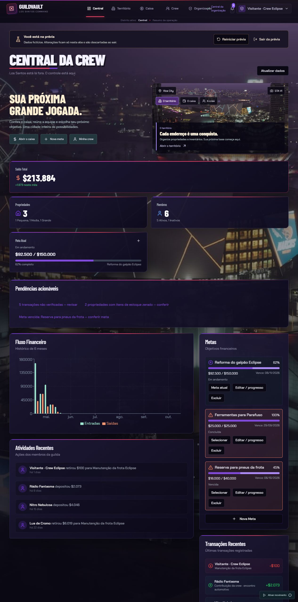
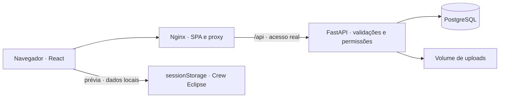

# GuildVault

### Gestão de organizações RP · Projeto full stack de portfólio

Aplicação desenvolvida por **Angelo Neri** para organizar membros, patrimônio, estoque, finanças e rotinas de comunidades de roleplay. Interface em React, regras de negócio em FastAPI e persistência em PostgreSQL, com uma prévia interativa sem cadastro.

**[Abrir demonstração ↗](http://173.212.251.120:8082/)** · **[Código no GitHub](https://github.com/AngeLZinS2/guildvault)** · **[LinkedIn](https://www.linkedin.com/in/angelo-neri-3921a72b9/)**

> Na tela de login, selecione **Explorar prévia**. Não é necessário informar credenciais.



## O projeto

O GuildVault é um exercício de desenvolvimento de ponta a ponta: transformar rotinas RP em telas, validações, permissões e operações persistentes. A apresentação visual acompanha o tema; o foco do portfólio está nos fluxos funcionais e nas escolhas de implementação.

- Cadastro, consulta, edição e exclusão conforme as permissões de cada módulo.
- Separação entre demonstração pública e acesso autenticado real.
- Integração entre operações, estoque, garagem, contribuições e caixa.
- Implantação com aplicação web, API e banco em serviços separados.

## Funcionalidades

| Área | Recursos implementados |
| --- | --- |
| Painel | Indicadores, pendências, metas e edição de progresso |
| Membros | Cadastro, perfil, contribuições, extrato e controle de acesso |
| Patrimônio e inventário | Propriedades, itens, busca, entradas, saídas e transferências com histórico |
| Finanças | Depósitos, retiradas, comprovantes, aprovação, filtros e paginação |
| Agenda | Compromissos, filtros de prazo e lembretes para compartilhamento manual |
| Organização RP | Tipo de organização, cargos e permissões por módulo |
| Operações e garagem | Participantes, materiais, resultados, retirada, devolução e manutenção |
| Contribuições e produção | Quitação em dinheiro ou itens, receitas, encomendas e consumo de materiais |
| Pessoas e comunicação | Recrutamento, formação, avisos e confirmação de leitura |
| Acompanhamento | Histórico de ações e prestação de contas por período |

Os módulos atendem facções/gangues, empresas, corporações e grupos mistos. Configurar o tipo não cria isolamento multiempresa: a aplicação trabalha com uma organização na mesma base.

## Prévia para visitantes

**Explorar prévia** abre a **Crew Eclipse**, com dados inteiramente fictícios. É possível experimentar cadastros e alterações sem acessar os dados reais.

- Dados editáveis ficam no `sessionStorage` da aba e sobrevivem à atualização da página.
- **Reiniciar prévia** restaura os exemplos; **Sair da prévia** descarta a sessão.
- Consultas, alterações e uploads da prévia não são enviados ao backend nem ao PostgreSQL.
- Imagens e PDF de até **1 MB** ficam locais; a cota do navegador pode exigir reiniciar a prévia.
- A demonstração não cria uma conta administrativa nem emite um JWT válido.

O carregamento da página e de seus recursos visuais ainda utiliza a rede. O isolamento diz respeito aos dados e às ações da sessão de demonstração.

## Stack e arquitetura

| Camada | Tecnologias |
| --- | --- |
| Interface | React 18, TypeScript, Vite, Tailwind CSS e shadcn/ui |
| Interação e visualização | Framer Motion, Recharts e Three.js |
| API | Python, FastAPI, Pydantic e SQLAlchemy |
| Autenticação | JWT e hash de senhas Argon2 |
| Persistência | PostgreSQL 16 e volume de uploads |
| Implantação | Docker Compose e Nginx |



### Escolhas técnicas e segurança

- **Autorização no servidor:** ocultar um botão não substitui a validação de identidade e permissão.
- **JWT com expiração de 12 horas** e senhas como hash Argon2; hashes não são retornados nos perfis.
- **Administração:** administradores executam ações administrativas; apenas o superadministrador promove ou remove administradores.
- **Regras de domínio:** autoria e aprovação financeira são determinadas no servidor; valores, quantidades e datas são validados.
- **Consistência:** produção e transferências de estoque usam transações e bloqueio de linhas no PostgreSQL.
- **Uploads reais:** aceitam imagens e PDF; a prévia mantém seus arquivos apenas no navegador.

## Executar localmente

### Docker Compose

Pré-requisito: Docker com Compose disponível. Na raiz do projeto:

```bash
cp .env.example .env
```

No PowerShell, use `Copy-Item .env.example .env`. Edite o arquivo antes de iniciar. Estes valores são apenas placeholders:

```dotenv
POSTGRES_DB=guildvault
POSTGRES_USER=guildvault
POSTGRES_PASSWORD=<defina-uma-senha-forte>
JWT_SECRET=<gere-uma-chave-aleatoria-longa>
ADMIN_STATE_ID=<defina-o-id-inicial>
ADMIN_PASSWORD=<defina-uma-senha-admin-forte>
APP_PORT=8082
```

```bash
docker compose up --build -d
docker compose ps
```

Acesse `http://localhost:8082`. O primeiro acesso autenticado usa o `ADMIN_STATE_ID` e o `ADMIN_PASSWORD` definidos no seu `.env`. Para explorar sem credenciais, utilize a prévia.

| Serviço | Container | Responsabilidade |
| --- | --- | --- |
| `frontend` | `guildvault_frontend` | Nginx, SPA e proxy da API |
| `api` | `guildvault_api` | Autenticação e regras de negócio |
| `postgres` | `guildvault_postgres` | Persistência dos dados reais |

Os volumes `guildvault_pgdata` e `guildvault_uploads` preservam banco e arquivos entre recriações dos containers. **Não use `docker compose down -v` se precisar preservar os dados.** Volumes não substituem backup. Não versione o `.env`.

### Desenvolvimento separado

Com Node.js/npm instalados, execute `npm install` e `npm run dev`. O frontend usa a porta **8080** e encaminha `/api` para a porta **8000**.

Para a API, use um ambiente virtual Python e configure `DATABASE_URL` para seu PostgreSQL local, `JWT_SECRET`, `ADMIN_STATE_ID`, `ADMIN_PASSWORD` e um `UPLOAD_DIR` local gravável:

```bash
python -m pip install -r backend/requirements.txt
uvicorn backend.main:app --reload --port 8000
```

## Validação

Com as dependências instaladas, os comandos de verificação são:

```bash
node src/demo/demoSession.test.mjs
node src/utils/financeContent.test.mjs
npx tsc --noEmit -p tsconfig.app.json
npm run build
npm run lint
python -m pip install -r backend/requirements-dev.txt
python -m unittest backend.test_content -v
docker compose config
```

Execute os testes da API em processo dedicado: configuram e removem um **SQLite temporário isolado**, sem usar o PostgreSQL de produção. Essa suíte não comprova bloqueios concorrentes do PostgreSQL. Os comandos documentam a verificação, não uma garantia de aprovação de toda execução.

## Escopo e limites

Metas têm progresso manual; lembretes não são enviados automaticamente. Não há integração configurada com servidor RP ou Discord. O relatório não é um fechamento contábil imutável, e o modelo monetário atual utiliza `Float`. Consulte [Conteúdo](design-system/guildvault/CONTEUDO.md) e [Organização RP](design-system/guildvault/ORGANIZACAO.md).

A demonstração pública usa HTTP: utilize dados fictícios e não envie informações sensíveis. Para acesso real pela internet, configure HTTPS.

## Créditos e distribuição de assets

O repositório público não inclui os modelos opcionais Audi R8/policiais nem as gravações de áudio de terceiros cuja redistribuição pública não foi confirmada. Esses recursos permanecem na VPS; a experiência visual completa está na demonstração hospedada. Um clone não contém todos os arquivos binários, e a ausência do Audi pode acionar o pôster de fallback.

A garagem procedural original, o tráfego CarConcept sob CC BY e os personagens gerados sob CC0 podem acompanhar o código. Consulte a procedência e os termos em [Créditos 3D](public/licenses/guildvault-3d.txt), [CarConcept](public/licenses/carconcept-cc-by-4.0.txt), [UIverse](public/licenses/uiverse.txt) e [demais avisos](public/licenses/). Esses termos não atribuem uma licença universal ao projeto nem autorizam redistribuir qualquer asset.

Projeto independente de portfólio, sem afiliação, aprovação ou licenciamento oficial de GTA, Rockstar Games ou marcas de veículos citadas.

Veja os arquivos opcionais e orientações para um clone em [Assets da experiência visual](docs/ASSETS.md).

## Autor

**Angelo Neri** · [GitHub: AngeLZinS2](https://github.com/AngeLZinS2) · [LinkedIn](https://www.linkedin.com/in/angelo-neri-3921a72b9/)

[Código e decisões técnicas](https://github.com/AngeLZinS2/guildvault) · [Apresentação para LinkedIn](docs/LINKEDIN.md)
